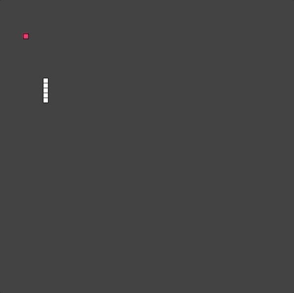

# Snake

Snake is an old classic arcade game, originated in 1976, with which most of us are already familiar.
There is a snake in this game which grows in length as we feed it.
The goal is to make the snake as long as possible before ultimately dying!

## Gameplay Sample

## Author

<table>
<tr>
<td>

Divyanshu N Singh

</td>
</tr> 
</table>

This game is inspired from a project by Daniel Shiffman.
